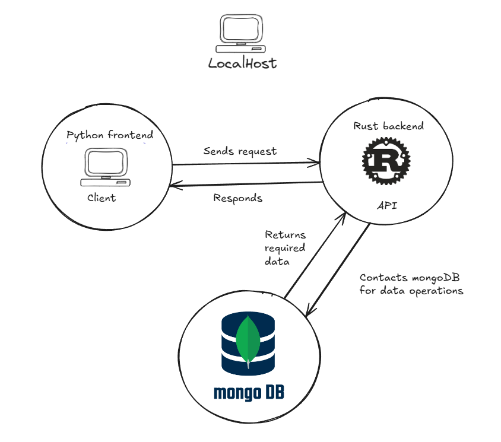
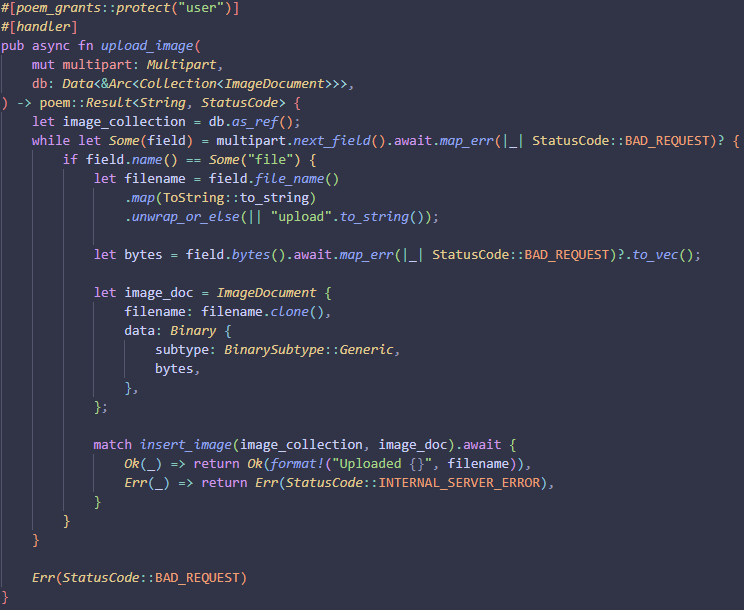

# Building Systems in Rust exam project

By
Patrick Diekmann - cph-pd66@cphbusiness.dk
Pelle Hald Vedsmand - cph-pv73@cphbusiness.dk
Nicolai Rosendahl - cph-nr135@cphbusiness.dk

## Project Introduction

This project is an online file storage system, built with a Rust backend, Streamlit frontend and mongoDB for persistence. The application allows for users to log in, upload files and download files they own. Uploaded files are stored in a document database (mongoDB), with individual documents consisting of its metadata, content and ownership. The backend exposes a REST API that handles authentication, file upload/download and endpoints for user management. The frontend however doesnt allow for user management, including user creation, update and delete.

The motivation for choosing this project was to explore the experience of working with Rust in a full-stack context, while getting first hand experience with:

- How Rust handles concurrency - allowing multiple users to access the API and it's features.
- Memory safety - keeping the application memory safe, despite the application's lifetime being indefinite.
- Error handling - Ensuring correct utilization of Rust's pattern matching.
- Performance - Using a low-level language like Rust for the backend in a fullstack application - To showcase the performance benefits.

The goal was to get a better understanding of the strengths and weaknesses of Rust.

#### Walkthrough of app flow

User is prompted to log in. (Keep in mind a user is allowed to navigate to the document manager site, but is not allowed to use the feature without logging in)


Upon succesful login the user is prompted to navigate to the the document manager site.


On the document manager site an authorized user has the option to upload new files, and see files they've already uploaded. When uploading a file it is immediatly added to the list of available files, ready for download.
*Uploaded files are limited to 16 mb.


When clicking a download button, the corresponding file will be downloaded in the same format as it was initially uploaded.


## Requirements and Setup

#### Prerequisites:

- Rust >= 1.75
- MongoDB instance running on localhost:27017
- Python >= 3.9
  - Python packages installed via requirements.txt
  - `pip install -r requirements.txt`

#### Running the application:

Open a terminal in the root of the project and run the following command to start the API:
`cargo run`

In a new terminal navigate to the folder named StreamlitApp and use the following command to start the frontend application:
`cd .\StreamlitApp\`


`python -m streamlit run start.py`

The frontend should now be accessible on http://localhost:8501, and the API is exposed on http://localhost:3000.

#### API endpoints:

Routes without authentication:

```
post /login
    Requires json body:
        {
            "username": "insertUsername",
            "password": "insertPassword",
        }
    Responds with jwt token
```

All subsequent routes require an authorization header with a bearer token.

Admin routes:

```
post /user/add
    Requires json body:
        {
            "username": "insertUsername",
            "password": "insertPassword",
            "role": [
                "insertRole",
                "insertRole",
            ]
        }

get /user/:name

put /user:name
    Requires json body:
    {
        "username": "insertUsername",
            "password": "insertPassword",
            "role": [
                "insertRole",
                "insertRole",
            ]
    }

delete /user/:name
```

User routes:

```
get /files

post /upload
    Required to send along a multipartfile

get /download_file/:filename

post /upload_image
    Required to send along a multipartfile

get /download_image/:imagename
```

#### Initial DB setup

Whenever the API starts it will make sure it has access to a collection in mongoDB called users, that the username in the users collection is indexed, and that there are 2 test users available - 1 admin user and 1 regular user with the following credentials:

```
Admin user
username: test
password: test

Regular user
username: test2
password: test
```

If any of the 3 states (users collection, username index, 2 test users) is not present it will be added automatically. If you want to stop this behaviour remove the following line from main.rs.

```
    let _ = initial_user_db_setup(&collection).await;
```

## Design

#### System architecture



#### API framework

For the API framework, we had the choice between Poem and Axum.
From the research we conducted, we could conclude that Poem was more lightweight than Axum.
We tried running the 1.0.0 version of Poem, but had problems with newer versions of the other packages in use, so we had to switch to 3.0.
Since the program was designed to showcase Rust as a programming language, we went with Poem rather than the heavier Axum.
Poem also required less 'boiler plate code', when configuring, which was another reason it was the API framework of choice for our project.

#### Authentication flow

For authentication and authorization a JWT token, holding a username, permissions and an expiration date is created and returned to the client upon login.
The JWT token is then added to the authorization header as a bearer token to all subsequent requests, which then passes through our middleware implementation that makes sure that the permissions held in the token gives access to the requested endpoint.


#### DB structure

For the handling of files and users, we went with a minimalistic setup, which would help us achieve achieve a good 'error free' product.

Below are the mongodb Collections of Documents we used:

##### **files**:

- \_id (ObjectId) **_hex_**
- filename **_String_**
- content **_BSON binary_**
- user **_String_**

##### **users**:

- \_id (ObjectId) **_hex_**
- username **_String_**
- password **_String_**
- role **_Array_** (users can have multiple roles ie. admin and user)

_username_unique_index_ - to make sure that the usernames are unique and to faster search for users based on the index.

#### Project structure

We have split the files into modules based on their type of functionality.


#### Error handling

The implemented error handling is focused around using Result, and thereby mapping the enums Ok() and Err(). We chose to go with this approach because the API framework poem has an implementation of Result that works well with how the API operates.

Generally speaking we went with the approach of using the match pattern to handle the different outcomes of the poem Result, however we also tried to use map_err() to map the error cases in one liners, but we found that approach less readable than using match, where we were able to flesh out our Result handling.

In the example below we created a function utilizing both approaches for handling errors.
We used two different approaches of handling errors.



#### Concurrency handling

For concurrency we handle it through the frameworks tokio and mongodb client. MongoDB client utilizes an internal thread pool to manage connections to the database, including establishing new connections and shutting down idle connections. The connection pool is then shared across the API using tokio, which enables us to share the connection pool concurrently across multiple threads. To do this we wrap each connection pool in an Arc to enable shared ownership across all the async tasks that tokio manages.

## Final thoughts

#### What went well

When we got the Rust backend running - we were very impressed with the overall speed.

We didnt receive any errors when using the API, since all the errors were caught during compile time.

We were impressed with the minimal setup of Poem and Tokio, and implementing them went very well.

#### What was challenging

Rust as a programming language has its quirks when it comes to syntax.
We struggled a lot with writing these long handlers.

We especially had problems with understanding Rust concepts like `|_|` and `some()`.

Understanding Rusts way of using memory and borrowing variables and pointers was a difficult concept for us to grasp.

A lot of the libraries we found were deprecated, some had almost no documentation, which made it difficult for us to choose libraries.

#### What would we do again and what we do differently

During the project we created all of the functions inside main.rs
We changed the project structure, which meant we had to do a lot of refactoring, which could be avoided from the start had we decided on a specific project structure.

We also had some problems with cargo and the dependencies, which could be avoided with a better structure from the start, having a correct gitignore and using compatible versions of imports.

## Future improvements

- Automated testing
- Previewing uploaded documents
- Handle document uploads of the same filename
- Add filtering / search functionality for documents
- Usage statistics
