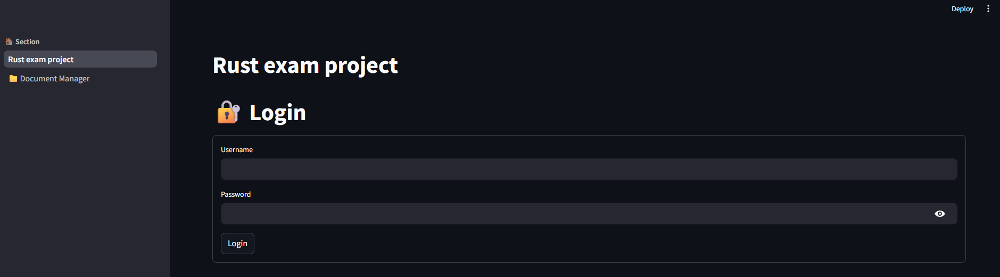
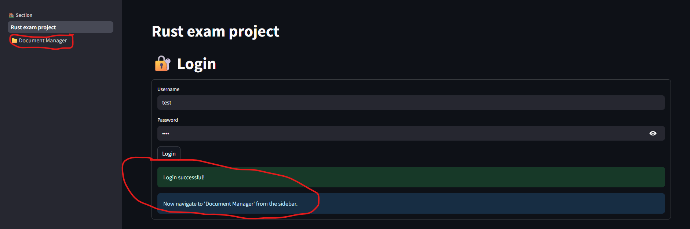
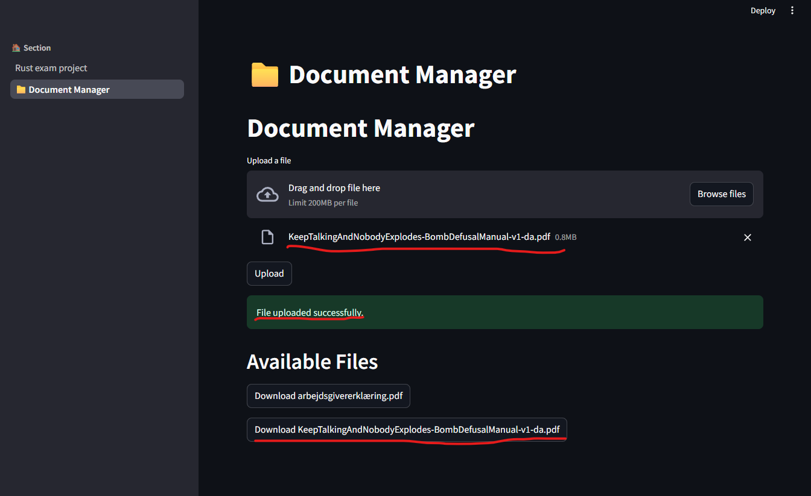
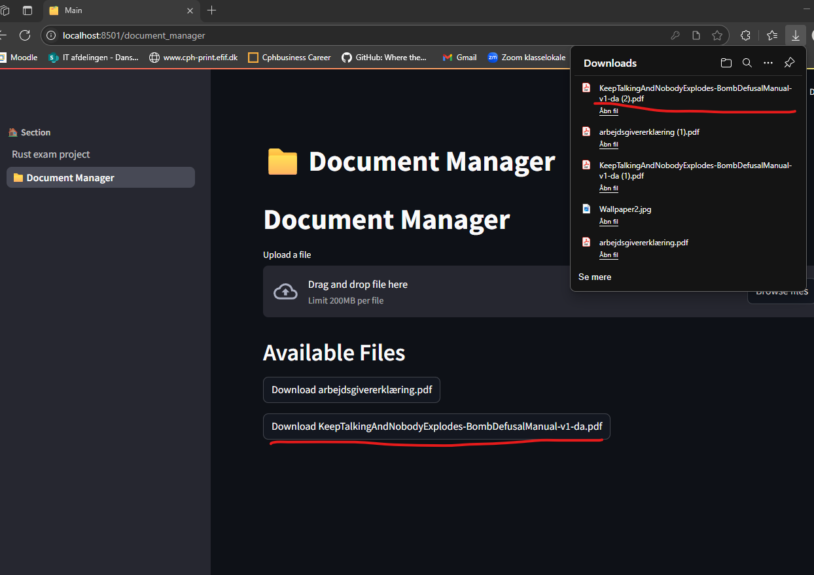

# Building Systems in Rust exam project
By 
Patrick Diekmann - cph-pd66@cphbusiness.dk
Pelle Hald Vedsmand - cph-pv73@cphbusiness.dk
Nicolai Rosendahl - cph-nr135@cphbusiness.dk

## Project Introduction

This project is an online file storage system, built with a Rust backend, Streamlit frontend and mongoDB for persistence. The application allows for users to log in, upload files and download files they own. Uploaded files are stored in a document database (mongoDB), with individual documents consisting of it's metadata, content and ownership. The backend exposes a REST API that handles authentication, file upload/download and endpoints for user management. (Last of which are not accessible on the frontend)

The motivation for choosing this project was to explore the experience of working with Rust in a full-stack context, while getting first hand experience with: 
* How Rust handles concurrency - allowing multiple users to access the API and it's features.
* Memory safety - keeping the application memory safe, despite the application's lifetime being indefinite.
* Error handling - Ensuring correctness utilizing Rust's pattern matching.

The goal was to get a better understanding of the strengths and weaknesses of Rust. 

#### Walkthrough of app flow

User is prompted to log in. (Keep in mind a user is allowed to navigate to the document manager site, but is not allowed to use the feature without logging in)



Upon succesful login the user is prompted to navigate to the the document manager site.



On the document manager site an authorized user have the option to upload new files, and see files they've already uploaded. When uploading a file it is immediatly added to the list of available files, ready for download.



When clicking a download button, the corresponding file will be downloaded in the same format as it was initially uploaded.



## Requirements and Setup

#### Prerequisites:
* Rust >= 1.75
* MongoDB instance running on localhost:27017
* Python >= 3.9
    * Python packages installed
    * Streamlit ```pip install streamlit```
    * Requests ```pip install requests```

#### Running the application:
Open a terminal in the root of the project and run the following command to start the API:
```cargo run```

In a new terminal navigate to the folder named StreamlitApp and use the following command to start the frontend application:
```streamlit run start.py```

The frontend should now be accessible on http://localhost:8501, and the API is exposed on http://localhost:3000.

#### API endpoints:
Routes without authentication:
```
post /login
    Requires json body:
        {
            "username": "insertUsername",
            "password": "insertPassword",
        }
    Responds with jwt token 
```
All subsequent routes require an authorization header with a bearer token.

Admin routes:
```
post /user/add
    Requires json body:
        {
            "username": "insertUsername",
            "password": "insertPassword",
            "role": [
                "insertRole",
                "insertRole",
            ]
        }

get /user/:name

put /user:name
    Requires json body:
    {
        "username": "insertUsername",
            "password": "insertPassword",
            "role": [
                "insertRole",
                "insertRole",
            ]
    }

delete /user/:name
```

User routes:
```
get /files

post /upload
    Required to send along a multipartfile

get /download_file/:filename

post /upload_image
    Required to send along a multipartfile

get /download_image/:imagename
```

#### Initial DB setup

Whenever the API starts it will make sure it has access to a collection in mongoDB called users, that the username in the users collection is indexed, and that there is 2 test users available - 1 admin user and 1 regular user with the following credentials: 

```
Admin user
username: test
password: test

Regular user
username: test2
password: test
```

If any of the 3 states (users collection, username index, 2 test users) is not present it will be added automatically. If you want to stop this behaviour remove the following line from main.rs.

```
    let _ = initial_user_db_setup(&collection).await;
```

## Design

## State of implementation

## Final thoughts

## Future improvements